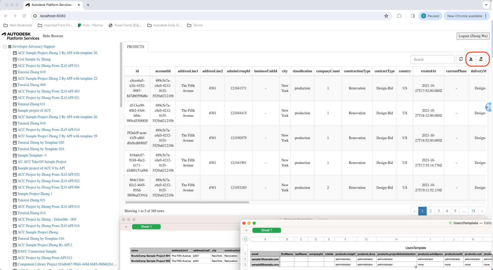

# Forma Admin Tutorial (.NET)

[Autodesk Platform Services](https://aps.autodesk.com) application built by following
the [Forma Administrator](https://get-started.aps.autodesk.com/tutorials/acc-admin/) tutorial
from https://get-started.aps.autodesk.com.

## Development

### Prerequisites

- [APS credentials](https://aps.autodesk.com/en/docs/oauth/v2/tutorials/create-app)
- [Forma for Construction](https://fieldofviewblog.wordpress.com/2017/08/31/bim-360-acc-account-for-development/)
- Provisioned access to [Autodesk Forma](https://tutorials.autodesk.io/#provision-access-in-other-products)
- [.NET 8](https://dotnet.microsoft.com/en-us/download/dotnet/8.0)
- Terminal (for example, [Windows Command Prompt](https://en.wikipedia.org/wiki/Cmd.exe)
or [macOS Terminal](https://support.apple.com/guide/terminal/welcome/mac))

### Setup & Run

- Clone this repository
- Install dependencies: `dotnet restore`
- Setup environment variables:
  - `APS_CLIENT_ID` - your APS application client ID
  - `APS_CLIENT_SECRET` - your APS application client secret
  - `APS_CALLBACK_URL` - URL for your users to be redirected to after they successfully log in with their Autodesk account
    - For local development, the callback URL is `http://localhost:8080/api/auth/callback`
    - For applications deployed to a custom domain, the callback URL is `http://<your-domain>/api/auth/callback` or `https://<your-domain>/api/auth/callback`
    - Do not forget to update the callback URL for your application in https://aps.autodesk.com/myapps as well
- Run the server: `dotnet run`

> When using [Visual Studio Code](https://code.visualstudio.com),
you can specify the env. variables listed above in a _.env_ file in this
folder, and run & debug the application directly from the editor.

## Troubleshooting

Please contact us via https://aps.autodesk.com/en/support/get-help.

## License

This sample is licensed under the terms of the [MIT License](http://opensource.org/licenses/MIT).
Please see the [LICENSE](LICENSE) file for more details.
